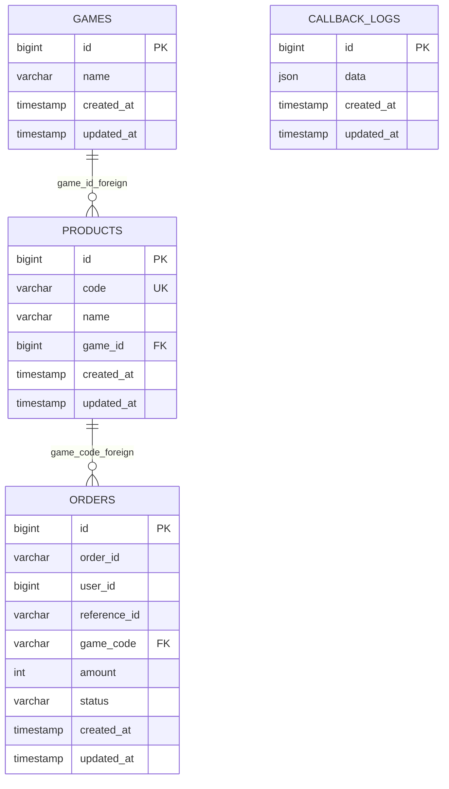

Why did you choose the current database structure?

A **game** may have many top up **products**, so they have a one-to-many relationships.
A top up **product** may be purchased many times, so **product** has a one-to-many relationships with **orders**.
The **callback_logs** only save a single real data that is a JSON, so in case the callback details changed, the **callback_logs** table do not need to be modified.

How did your system prevent duplicate order in 10 seconds?

When a user sends a request to create order, the app check the
**orders** table in the database to see if there's any record with
the same **reference_id** in the last 10 seconds. If there's any, the 
app will return a 409 HTTP response.

What happens if the callback is sent two requests of the same order?

The specified order will have its status be set to the **callback_status** of the latter request.

How did your system handle broken JSON or invalid fields?

For a broken JSON, we have a middleware that will return a 400 HTTP response
if it detects one. For the invalid fields, they are checked using Laravel's
built-in input validation which throws AuthenticationException that we caught
and we format to our custom JSON response format.

If this system is to be used in a real production transaction, which parts would you need to upgrade?

- First, the callback trigger must be removed since it is only for testing purpose.
- Second, I would add a one-to-many relationship between **users** and **orders**.
- Third, I would remove reference_id in the process of creating order because the client will be confused as to what to input.
  Instead, I will protect the create order process with authentication middleware.
  The anti-duplication system will use the user_id + game_code to determine duplicate order.

