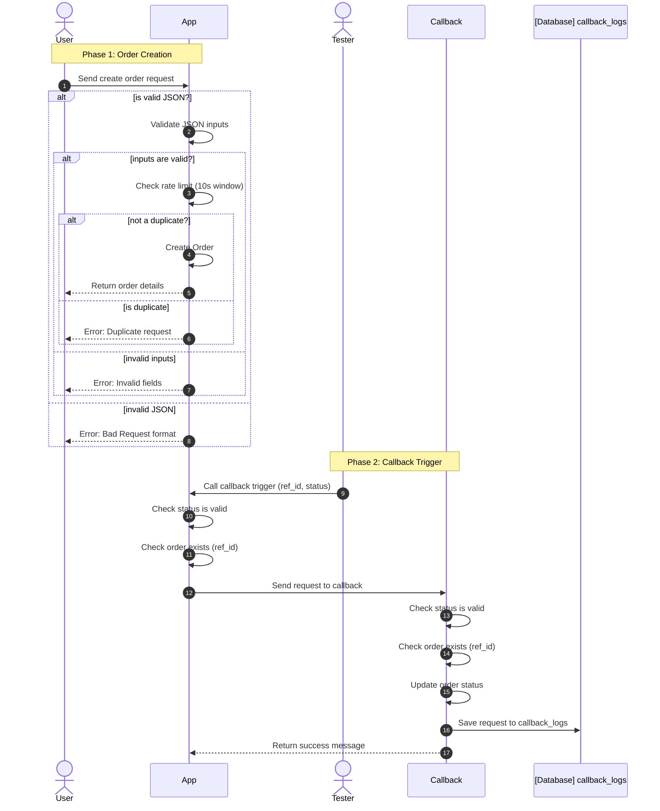
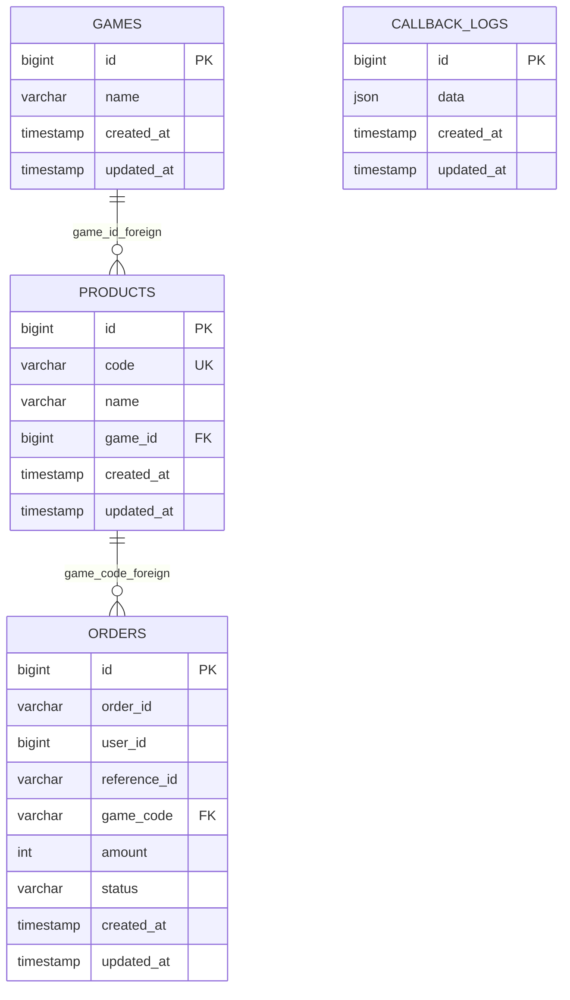

## The Flow

## The Database Structure

## 10 Seconds Anti-Duplicate-Request

When a user sends a request to create order, the app check the
**orders** table in the database to see if there's any record with
the same **reference_id** in the last 10 seconds. If there's any, the 
app will return a 409 HTTP response.
